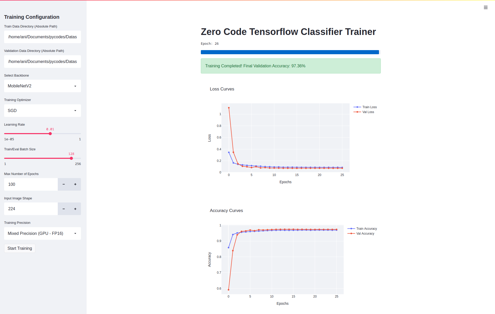

[![Contributors][contributors-shield]][contributors-url]
[![Forks][forks-shield]][forks-url]
[![Stargazers][stars-shield]][stars-url]
[![Issues][issues-shield]][issues-url]
[![MIT License][license-shield]][license-url]
[![LinkedIn][linkedin-shield]][linkedin-url]

<!-- PROJECT LOGO -->
<br />
<p align="center">
    

  <h2 align="center">Zero Code TF Image Classification Trainer</h2>

  <p align="center">
    Start Training a State of the Art Image Classifier within Minutes with Zero Coding Knowledge
    <br />
    <a href="https://hub.docker.com/repository/docker/animikhaich/zero-code-tf-classifier">Docker Image</a>
    ·
    <a href="https://github.com/animikhaich/Zero-Code-TF-Classifier/issues/new">Report Bug</a>
    ·
    <a href="https://github.com/animikhaich/Zero-Code-TF-Classifier/issues/new">Request Feature</a>
  </p>
</p>
<p align="center">
  
</p>
<!-- TABLE OF CONTENTS -->

## Table of Contents

- [Table of Contents](#table-of-contents)
- [About The Project](#about-the-project)
- [Features](#features)
- [Hardware Requirements](#hardware-requirements)
  - [Hardware used for Development and Testing](#hardware-used-for-development-and-testing)
  - [Minimum Hardware Requirements](#minimum-hardware-requirements)
- [Getting Started](#getting-started)
  - [Prerequisites](#prerequisites)
  - [Built With](#built-with)
- [Setup and Usage](#setup-and-usage)
- [Changelog](#changelog)
- [Roadmap](#roadmap)
- [Contributing](#contributing)
- [License](#license)
- [Contact](#contact)
    - [Animikh Aich](#animikh-aich)

<!-- ABOUT THE PROJECT -->

## About The Project

Don't know How to Write Complex Python Programs? Feeling Too Lazy to code a complete Deep Learning Training Pipeline Again? Need to Quickly Prototype a Image Classification Model?

Okay, Let's get to the main part. This is a **Containerized Deep Learning-based Image Classifier Training Tool** that allows anybody with some basic understanding of Hyperparameter Tuning to start training a Image Classification Model.

For the Developer/Contributor: The code is easy to maintain and work with. No Added Complexity. Anyone can download and build a Docker Image to get it up and running with the build script.

## Features

- **Zero Coding Required** - I have said this enough, I will repeat one last time: No need to touch any programming language, just a few clicks and start training!
- **Easy to use UI Interface** - Built with Streamlit, it is a very user friendly, straight forward UI that anybody can use with ease. Just a few selects and a few sliders, and start training. Simple!
- **Live and Interactive Plots** - Want to know how your training is progressing? Easy! Visualize and compare the results live, on your dashboard and watch the exponentially decaying loss curve build up from scratch!

If you want to go in-depth with the Technical Details, then there are too many to list here. I would invite you to check out the [Changelog](CHANGELOG.md) where every feature is mentioned in details.  

## Hardware Requirements

We recommend an [Nvidia GPU](https://www.nvidia.com/en-gb/graphics-cards/) for Training, However, it can work with CPUs as well (Not Recommended)

[Google Cloud TPUs](https://cloud.google.com/tpu) are Supported as per the code, however, the same has not been tested.

### Hardware used for Development and Testing

- **CPU:** AMD Ryzen 7 3700X - 8 Cores 16 Threads
- **GPU:** Nvidia GeForce RTX 2080 Ti 11 GB
- **RAM:** 32 GB DDR4 @ 3200 MHz
- **Storage:** 1 TB NVMe SSD 
- **OS:** Ubuntu 20.10

The above is just used for development and by no means is necessary to run this application. The Minimum Hardware Requirements are given in the next section

### Minimum Hardware Requirements

- **CPU:** AMD/Intel 4 Core CPU (Intel Core i3 4th Gen or better)
- **GPU:** Nvidia GeForce GTX 1650 4 GB (You can go lower, but I would not recommend it)
- **RAM:** 8 GB (Recommended 16 GB)
- **Storage:** Whatever is required for Dataset Storage + 10 GB for Docker Image
- **OS:** Any Linux Distribution

## Getting Started

### Prerequisites

- [Docker](https://www.docker.com/)
- [Nvidia Docker](https://github.com/NVIDIA/nvidia-docker)
- [Python 3](https://www.python.org/)
- [Git](https://git-scm.com/)

### Built With

- [Streamlit](https://streamlit.io/)
- [Tensorflow](https://www.tensorflow.org/)

## Setup and Usage

1. Install [Docker Engine](https://docs.docker.com/engine/install/)
2. Install [Nvidia Docker Engine](https://docs.nvidia.com/datacenter/cloud-native/container-toolkit/install-guide.html) (Required only for System with Nvidia GPU)
3. Set up the Dataset Structure:

```sh
.
├── Training
│   ├── class_name_1
│   │   └── *.jpg
│   ├── class_name_2
│   │   └── *.jpg
│   ├── class_name_3
│   │   └── *.jpg
│   └── class_name_4
│       └── *.jpg
└── Validation
    ├── class_name_1
    │   └── *.jpg
    ├── class_name_2
    │   └── *.jpg
    ├── class_name_3
    │   └── *.jpg
    └── class_name_4
        └── *.jpg
```

4. There are two methods:
   - Pull the Image from [Docker Hub Repository](https://hub.docker.com/repository/docker/animikhaich/zero-code-tf-classifier)
   - Clone the Repo and Build the Docker Image using the [build script](build.sh)
5. Once the Docker Image is Built/Pulled, run the image using the following command:

```sh
docker run -it --runtime nvidia --net host -v /path/to/dataset:/data <image-name>
```

6. After training the trained weights can be found at: `/app/model/weights` Inside the Container
7. After training the Tensorboard Logs can be found at: `/app/logs/tensorboard` Inside the Container
8. You can use `docker cp <container-name/id>:<path-inside-container> <path-on-host-machine>` to get the weights and logs out. Further details can be found here: [Docker cp Docs](https://docs.docker.com/engine/reference/commandline/cp/)


## Changelog

See the [Changelog](CHANGELOG.md).


## Roadmap

See the [Open Issues](https://github.com/animikhaich/Zero-Code-TF-Classifier/issues?q=is%3Aopen) for a list of proposed features (and known issues).

See the [Changelog](CHANGELOG.md) a lost of changes currently in development.


## Contributing

Contributions are what make the open source community such an amazing place to be learn, inspire, and create. Any contributions you make are **greatly appreciated**.

1. Fork the Project
2. Create your Feature Branch (`git checkout -b feature/AmazingFeature`)
3. Commit your Changes (`git commit -m 'Add some AmazingFeature'`)
4. Push to the Branch (`git push origin feature/AmazingFeature`)
5. Open a Pull Request


## License

Distributed under the MIT License. See [LICENSE](LICENSE.md) for more information.


## Contact

#### Animikh Aich

- Website: [Animikh Aich - Website](http://www.animikh.me/)
- LinkedIn: [animikh-aich](https://www.linkedin.com/in/animikh-aich/)
- Email: [animikhaich@gmail.com](mailto:animikhaich@gmail.com)
- Twitter: [@AichAnimikh](https://twitter.com/AichAnimikh)


[contributors-shield]: https://img.shields.io/github/contributors/animikhaich/Zero-Code-TF-Classifier.svg?style=flat-square
[contributors-url]: https://github.com/animikhaich/Zero-Code-TF-Classifier/graphs/contributors
[forks-shield]: https://img.shields.io/github/forks/animikhaich/Zero-Code-TF-Classifier.svg?style=flat-square
[forks-url]: https://github.com/animikhaich/Zero-Code-TF-Classifier/network/members
[stars-shield]: https://img.shields.io/github/stars/animikhaich/Zero-Code-TF-Classifier.svg?style=flat-square
[stars-url]: https://github.com/animikhaich/Zero-Code-TF-Classifier/stargazers
[issues-shield]: https://img.shields.io/github/issues/animikhaich/Zero-Code-TF-Classifier.svg?style=flat-square
[issues-url]: https://github.com/animikhaich/Zero-Code-TF-Classifier/issues
[license-shield]: https://img.shields.io/github/license/animikhaich/Zero-Code-TF-Classifier.svg?style=flat-square
[license-url]: https://github.com/animikhaich/Zero-Code-TF-Classifier/blob/master/LICENSE.md
[linkedin-shield]: https://img.shields.io/badge/-LinkedIn-black.svg?style=flat-square&logo=linkedin&colorB=555
[linkedin-url]: https://linkedin.com/in/animikh-aich/
[product-screenshot]: assets/face-blur-demo.gif
